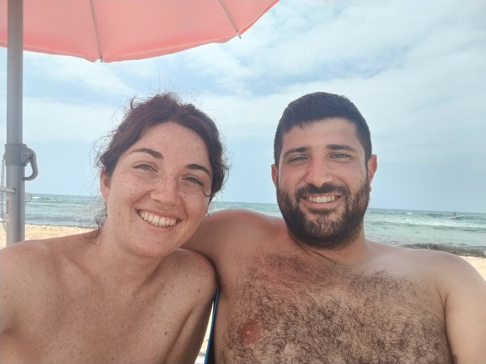

  <!-- <h2>🌍 Explorando el Mundo, un Viaje a la Vez</h2> -->
  

    Aquí vamos documentando de manera caótica y anárquica nuestros viajes, sin orden específico.
    Cada aventura es única y la contamos como nos sale del corazón.
  

  

    💌 Si tienes cualquier duda o comentario sobre alguno de los viajes, la mejor forma es contactarnos en 
    <a href="mailto:contacto@sospeso.cafe" style="color: #e67e22; text-decoration: none; font-weight: 500;">contacto@sospeso.cafe</a>
  

---

### 🇬🇷🇧🇬 **Grecia y Bulgaria 2025** 

  
📅 Septiembre 2024 • 🏛️ Historia Milenaria • 🏔️ Paisajes Balkánicos

Un viaje épico por los Balcanes donde exploramos templos griegos milenarios, monasterios ortodoxos búlgaros y paisajes montañosos que quitan el aliento. Una inmersión profunda en la rica historia y cultura de estos fascinantes países del sureste europeo.


  
  



🔍 Ver Viaje →


---

### 🇪🇸 **Almería 2023**

  
📅 Julio 2023 • 🏖️ Costa Mediterránea • 🥘 Gastronomía Andaluza

Una escapada perfecta a la luminosa costa andaluza, donde disfrutamos del sol mediterráneo, playas de arena dorada y la exquisita gastronomía local. Un reencuentro con la belleza del sur de España y sus tradiciones milenarias.


  
  



🔍 Ver Viaje →


---

  <h3 style="color: #2c3e50; margin-bottom: 1rem;"> ¿Tienes Dudas?</h3>
  

        Si tienes cualquier duda o comentario sobre alguno de los viajes, la mejor forma es contactarnos en <a href="mailto:contacto@sospeso.cafe" style="color: #e67e22; text-decoration: none; font-weight: 500;">contacto@sospeso.cafe</a>
  

  
💌

